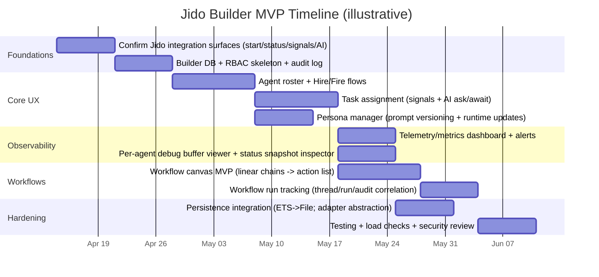

Confidence: 8.5/10  
Timestamp (America/Chicago): 2026-04-11 00:00

# Jido Deep Research Report

## Executive summary

Jido is an open-source agent framework for Elixir designed around a strict separation of concerns: agents are immutable data structures; actions are schema-validated computations; signals are standardized CloudEvents envelopes for inbound and outbound messaging; directives are pure “effect requests” that the runtime executes under supervision. This architecture exists to make agent systems deterministic, testable, and production-operable without tying the entire concept of “agent” to LLMs. citeturn21search4turn2view0turn2view1turn20view0

Operationally, Jido provides an OTP runtime (AgentServer) that runs agents as supervised GenServers registered in a registry, processes signals via synchronous `call/3` or async `cast/2`, routes signals through a trie-based router, drains a directive queue, and offers configurable error policies, debug tooling, telemetry/metrics, and persistence hooks. citeturn18search17turn2view1turn27view0turn26view0turn25view0turn28view0

AI is optional. Jido’s AI layer lives in `jido_ai`, which builds on `req_llm` (provider-agnostic LLM HTTP client) and `llmdb` (model metadata database). With `jido_ai`, you can run multi-turn chat agents by reusing the same agent process (PID), stream partial model output via runtime snapshots, and run tool-calling agents where tools are simply Jido Actions exposed to the LLM via generated JSON Schema definitions. citeturn30view0turn29view0turn24view0turn2view0

From the GitHub repo, Jido currently releases as v2.2.0 (tagged March 29, 2026) while the public docs site footer shows 2.1.0—meaning a Builder UI should assume mild doc/code drift and lean on runtime introspection (status snapshots, telemetry, recent event buffers) and explicit compatibility layers. citeturn22view0turn26view0turn25view0

A Jido Builder UI/UX (HR-style “hire/fire agents”) is feasible and aligns well with Jido’s primitives: “hire” maps cleanly to starting an AgentServer/agent instance; “assign task” maps to sending signals or initiating AI requests; “personas” map to system prompts (updatable at runtime); “monitor/audit” can be driven from AgentServer status snapshots, debug ring buffers, thread journals, persistence checkpoints, and telemetry events/metrics. citeturn18search17turn30view0turn26view0turn3view3turn28view0turn25view0

Key official sources used (links):
```text
Docs: https://jido.run/docs
Core concepts: https://jido.run/docs/concepts
GitHub repo: https://github.com/agentjido/jido
Release v2.2.0: https://github.com/agentjido/jido/releases/tag/v2.2.0
```

## Current Jido capabilities

### Core primitives and contracts

**Agents are immutable structs (pure data), not processes.** The central contract is `cmd/2`: you pass an agent and an instruction/action and receive `{updated_agent, directives}`. There is no GenServer inside the agent; process concerns live in AgentServer. This makes agents serializable, composable, and easy to test without starting processes. citeturn21search4turn5search9turn10view0

**Actions are discrete, validated computation units with compile-time configuration and runtime schemas.** An action is an Elixir module using `use Jido.Action` and implementing `run/2`. Actions declare input schemas (and optional output schemas) and are validated at runtime; Jido’s action model is intentionally “open validation” (undeclared fields pass through), enabling composability across chained actions. Actions can also be normalized into `%Jido.Instruction{}` structs and chained via `cmd/2`. citeturn2view0turn3view2

**Signals are the universal message format.** Jido signals implement CloudEvents v1.0.2 with Jido extensions, using UUID v7 identifiers for time-ordered IDs and easier chronological sorting/indexing. Signals can be declared ad hoc (`Signal.new/…`) or as typed modules (`use Jido.Signal`) with schemas. citeturn2view1turn18search20

**Signal routing is a first-class runtime concern.** When a signal arrives at AgentServer, it routes via a trie-based router built from strategy routes, agent routes, and plugin routes with explicit priority ordering. The router supports exact matches and wildcard patterns. citeturn2view1

**Directives are pure descriptions of effects, executed by the runtime.** Jido’s invariant is that the agent returned by `cmd/2` is already complete; directives are not “applied” to state. The runtime executes directives using a protocol (`Jido.AgentServer.DirectiveExec`) that dispatches by directive struct type, preserves directive order, and safely ignores unknown directive types via protocol fallback. Built-in directive concepts documented include `Emit`, `Schedule`, `Cron`/`CronCancel`, `SpawnAgent`, `StopChild`, `Spawn`, `RunInstruction`, `Stop`, and `Error`. citeturn20view0turn20view2

### Execution and strategy model

**Jido.Exec standardizes action execution mechanics.** `Jido.Exec` wraps action calls in a pipeline that validates inputs/outputs, enforces timeout budgets via `Task.Supervisor`, handles retries (exponential backoff), and can run compensation callbacks when enabled. It supports running an instruction struct directly and includes async patterns (`run_async/…`, `await/…`, `cancel/…`) in the execution concept docs. citeturn3view2turn5search7

**Strategies are pluggable execution models.** Strategies sit between `cmd/2` and action execution and control sequencing semantics. The docs describe core strategies like Direct (sequential) and FSM (finite state machine), with extension via custom strategy callbacks; ecosystem adds behavior tree and AI reasoning strategies. citeturn3view1turn18search18

### Runtime, orchestration, lifecycle, and debugging

**AgentServer runs agents as OTP processes.** Each AgentServer is a GenServer registered in `Jido.Registry`. You can start it with an agent module (which must implement `new/0` or `new/1`) or an agent struct. Signals are the sole input channel to a running agent; you send them sync (`Jido.AgentServer.call/3`) or async (`cast/2`). citeturn18search17turn2view1

**Directive queues and backpressure signals exist.** AgentServer enqueues directives and drains them in order. The Agent runtime docs list a configurable `:max_queue_size` default of 10,000, and telemetry includes a queue overflow event `[:jido, :agent_server, :queue, :overflow]`. citeturn6search25turn25view0

**Error handling policies are explicit and runtime-enforced.** When actions return `{:error, reason}`, strategies produce `%Jido.Agent.Directive.Error{}` and AgentServer applies an `error_policy`. The guide documents five policies: `:log_only` (default), `:stop_on_error`, `{:max_errors, n}`, `{:emit_signal, dispatch_cfg}`, and a custom function handler. AgentServer processes run under a `DynamicSupervisor` and restart on crashes independent of error policies (which cover expected `{:error, …}` action results). citeturn27view0

**Debugging is built in at both instance and per-agent levels.** Jido debug levels (`:off`, `:on`, `:verbose`) control logging verbosity and event capture. Per-agent debug enables a ring buffer (up to 500 events) on an AgentServer process; you retrieve recent events with `Jido.AgentServer.recent_events/2`. Jido also exposes structured timeout diagnostics for `await_completion/2` timeouts and provides direct state/status queries (`Jido.AgentServer.state/1`, `status/1`). citeturn26view0

### Sensors, plugins, and integration surfaces

**Sensors bridge external events into signals.** A sensor is a GenServer-backed module defined via `use Jido.Sensor`; `Jido.Sensor.Runtime` wraps it, manages lifecycle, and forwards events into `handle_event/2` which can return directives like `{:emit, signal}` and scheduling directives for polling patterns. The docs explicitly position sensors for PubSub topics, HTTP webhooks, message queues, DB changes, and timers. citeturn3view0turn6search23

**Signal dispatch includes adapters for process, PubSub, HTTP, webhook (signed), and more.** `Jido.Signal.Dispatch` provides a unified interface with built-in adapters including `:pid`, `:pubsub` (Phoenix.PubSub), `:http`, `:webhook` (with signatures), plus developer conveniences like `:logger`, `:console`, and `:noop`. Batch dispatch supports concurrency controls. citeturn2view1

**Plugins package reusable capability bundles.** A plugin bundles actions, state slice, signal routes, and lifecycle hooks into a module that agents include to gain capabilities at compile time. Docs position plugins as a primary extension/sharing mechanism across agents/projects. citeturn21search16turn21search11

### Cognitive primitives and persistence

**Threads provide an append-only interaction log.** `Jido.Thread` is an immutable, append-only log capturing what happened, independent of any specific LLM provider formatting. Entries have `kind`, `payload`, and `refs` linking to signals, instructions, actions, agents, etc. Thread portability is explicit: provider-specific projections live in `jido_ai` (via `Jido.AI.Thread`) rather than in the core Thread model. citeturn3view3

**Memory provides mutable cognitive state with revision tracking.** Memory lives in agent state under reserved `:__memory__`, partitioned into named spaces (`:world` key-value and `:tasks` ordered list by default), each with independent revision counters to support fine-grained conflict detection. Memory is lazily allocated and implemented as a default singleton plugin that can be disabled per-agent. The default memory plugin is in-process only; external persistence requires custom plugin checkpoint/restore callbacks. citeturn19view0

**Persistence is explicitly split into storage behavior + persistence invariants.** `Jido.Storage` defines callbacks for checkpoints (overwrite semantics) and journals (append-only thread entries). Core docs describe built-in adapters `Jido.Storage.ETS` (ephemeral) and `Jido.Storage.File` (durable single-node). Persistence via `Jido.Persist.hibernate/…` and `thaw/…` snapshots agent state while keeping threads out of checkpoints via thread pointers (keeping checkpoints small regardless of thread size), and uses revision checks to detect inconsistency. citeturn3view4turn28view0

**Adapter details matter operationally.** The persistence guide documents ETS creating three tables (checkpoints, thread entries, thread metadata), file layout (atomic checkpoint writes via temp+rename; thread locking using `:global.trans/3`), and optimistic concurrency on thread append via `:expected_rev` returning `{:error, :conflict}` when stale. citeturn28view0

### AI capabilities and ecosystem packages

**AI agents and tool-calling.** `use Jido.AI.Agent` wires in AI reasoning strategies (e.g., ReAct) and supports tools via action modules. The weather agent guide is explicit: “tools are Actions,” Actions are converted to provider tool schemas via `Jido.AI.ToolAdapter.from_actions/…`, and tool-calling runs as a ReAct loop that alternates between model turns and action execution until a final answer or `max_iterations` is reached. The guide also documents async request handles (`ask/3` + `await/2`) and a sync helper (`ask_sync/…`). citeturn29view0turn2view0

**Multi-turn chat is achieved by reusing the same agent process.** The chat tutorial shows that multiple turns on the same PID preserve conversation context, and that conversation history can be inspected via `Jido.AgentServer.status(pid).snapshot.details[:conversation]`. citeturn30view0

**AI runtime mutability: system prompts can be updated on running agents.** While `system_prompt` is compile-time config within the agent macro, the docs show runtime updates through `Jido.AI.set_system_prompt/2`. citeturn30view0

**Streaming partial output is observable via snapshots.** The chat tutorial describes using async `ask/3` and polling `Jido.AgentServer.status/1` to read `status.snapshot.details[:streaming_text]` while a turn is running, then halting when `snap.done?`. citeturn30view0

**Provider abstraction is handled by ReqLLM + LLMDB.** The reference docs describe `req_llm` as a Req plugin with a unified interface across providers (Anthropic/OpenAI/Google/Mistral/Groq/Ollama…), with retries, rate limiting, streaming, and normalization. `llmdb` tracks capabilities, pricing, and context limits and provides lookup/filtering; `jido_ai` uses it for alias resolution and token budget validation. citeturn24view0turn4search8

### CLI, SDK surface, configuration, and developer tooling

**Local dev and docs-first workflow.** The official docs emphasize Livebook-based tutorials while remaining compatible with IEx; Jido works in any Elixir project and Phoenix is optional (with Phoenix LiveView described as a natural fit for web interfaces). citeturn5search5turn9search15

**Installation requirements and runtime secrets guidance.** Jido requires Elixir 1.18+ and OTP 27+ in docs; provider secrets are intended for `config/runtime.exs`. citeturn5search6turn5search5turn5search14

**Telemetry and observability are first-class.** Jido emits `:telemetry` events under `[:jido, …]` and provides a `Jido.Telemetry.setup/0` installer and `Jido.Telemetry.metrics/0` pre-built metrics. It includes log-level filtering, structured metadata fields (trace_id/span_id/agent_id/etc.), sensitive data redaction, and an experimental OpenTelemetry bridge package (`jido_otel`). citeturn25view0

**GitHub repo provides Mix/CLI tasks for scaffolding and install automation (Igniter-based).** The repo includes `mix jido.install` (adds config, creates `<App>.Jido` instance module, can add it to supervision tree, can generate an example agent), and generator tasks for agents/plugins/sensors with options like `--plugins`, `--signals`, `--interval`. These tasks require Igniter; the code explicitly instructs running `mix igniter.install jido` when Igniter isn’t loaded. citeturn17view4turn16view0turn17view1turn17view2

**Versioning snapshot.** The repository `mix.exs` defines `@version "2.2.0"` and lists core dependencies including `telemetry`, `telemetry_metrics`, `phoenix_pubsub`, and cron/time zone libraries, plus optional `igniter`. citeturn12view0turn13view0

### Security and limitations

Jido’s official docs emphasize **secret hygiene** (runtime secrets in `config/runtime.exs`) and provide **sensitive data redaction** options for telemetry metadata (redacted keys include common secret/token/key fields). citeturn5search6turn25view0

Jido provides **signed webhook delivery** as a dispatch adapter capability (`:webhook` “with signatures”), but the docs do not describe a full inbound authentication/authorization model; inbound auth would typically be implemented at the sensor boundary (e.g., an HTTP/webhook sensor verifying signatures and producing signals with auth context in extensions). citeturn2view1turn3view0

From the persistence guide, built-in durable storage is **single-node file-based**, using global locks to avoid corruption; high-concurrency or replicated production persistence is explicitly positioned as requiring a **custom adapter** (PostgreSQL/Redis/etc.). citeturn28view0turn3view4

Operational documentation has at least one gap: the docs’ “Operations” link currently resolves to a 404, so formal guidance on deployment/scaling may be incomplete on the public docs site (a Builder effort should plan for self-defined ops patterns). citeturn8view0turn7view0

Finally, Jido’s public docs pages show version 2.1.0 in the footer while GitHub releases show v2.2.0, implying that a Builder should expect mild mismatches and prioritize introspection + confirmed API references. citeturn22view0turn30view0turn28view0

## What you can build with Jido

The table below distinguishes what is directly supported (documented and already an intended usage), what is feasible with additional engineering (using explicit extension points), and what is speculative (would require undocumented internals, substantial new ecosystem pieces, or changes to Jido core).

| Category | Supported by Jido today | Feasible with work | Speculative / not implied by primary sources |
|---|---|---|
| Agent types | Deterministic agents (`Jido.Agent`); AI agents (`Jido.AI.Agent`) with system prompts and tool lists citeturn21search4turn30view0turn29view0 | “Managed agent” wrappers that load personas/tools dynamically from DB and reconfigure at runtime (using system prompt updates and tool registration patterns where available) citeturn30view0turn23search7 | Fully no-code agent definitions without any Elixir modules (would require a generalized interpreter agent + stable DSL and isn’t described in the docs) citeturn21search4 |
| Workflows | Action chaining via `cmd/2` and Exec chain semantics citeturn21search8turn3view2 | Visual workflow graphs compiled to action chains and signal emissions; adding governance gates via directives and error policies citeturn20view2turn27view0 | Cross-runtime “universal workflow spec” with guaranteed portability to non-BEAM runtimes |
| Orchestration | Parent-child hierarchies and multi-agent orchestration patterns via signals and skills (tutorials) citeturn5search11turn5search11turn2view1 | Large-scale coordinator patterns, dynamic specialist registration, file-backed skill catalogs (tutorial mentions loader) citeturn5search11turn1view5 | Autonomous multi-agent governance plane with formal policy engine + proof-carrying execution (not described) |
| Integrations | PubSub, HTTP, webhooks, PID messaging via dispatch adapters; sensors for external event sources citeturn2view1turn3view0 | Kafka/RabbitMQ/SQS connectors via custom sensors; inbound signature verification at sensor boundary; custom dispatch adapters | Turnkey “connect any SaaS” integration marketplace |
| Scaling | Multi-instance tagging in metrics (`jido_instance`), instance-level debug controls; BEAM process isolation rationale citeturn25view0turn26view0turn5search14 | Multi-node BEAM clustering patterns, sharding by tenant/workspace, autoscaling based on telemetry; durable storage beyond file/ETS via custom adapters citeturn28view0turn25view0 | Guaranteed linear scaling across regions with built-in multi-region consensus storage |
| Monitoring & audit | Telemetry events/metrics, debug ring buffer, status/state snapshots, thread journals, persistence checkpoints citeturn25view0turn26view0turn3view3turn28view0 | Full “audit ledger” service built on threads + signals + external DB; governance UI and incident workflows | Certified compliance attestation engine as part of core |
| Extensibility | Custom strategies, custom directives, custom plugins, custom storage adapters, custom signal types/modules citeturn3view1turn20view0turn21search16turn3view4turn2view1 | Domain-specific orchestration DSLs, policy layers, standardized “skill packaging” and registries | Cross-language SDKs maintained by Jido core team (not implied) |

A useful way to think about Jido’s “possibility space” is: **anything that can be expressed as** (signals in) → (validated action execution under a strategy) → (directives out) can be engineered into a robust agent system, because Jido formalizes each boundary and provides hooks to extend them. citeturn2view1turn3view1turn20view0turn3view2

## Jido Builder UI/UX architecture plan

### Product concept and architecture mapping to Jido primitives

The Builder metaphor (“HR-style hiring/firing agents”) maps naturally to Jido:

- **Hire agent** → start an AgentServer process running an agent module/struct (`Jido.start_agent` / `Jido.AgentServer.start_link`) with an ID and initial configuration, optionally enabling per-agent debug. citeturn18search17turn26view0  
- **Assign task** → send a Signal (`call/3` or `cast/2`) that routes to an action; for AI interactions, start an async `ask/3` request and `await/2`, or use sync `ask_sync`. citeturn18search17turn2view1turn29view0turn30view0  
- **Set persona** → update system prompt on the running agent (`Jido.AI.set_system_prompt`) and capture it in audit logs; optionally attach persona as a Signal extension for traceability. citeturn30view0turn2view1  
- **Workflow management** → represent workflows as directed graphs that compile to action chains (via `cmd/2` lists / Exec chaining) and/or orchestration signals; state is observable in snapshots and threads. citeturn21search8turn3view2turn3view3  
- **Monitor** → use AgentServer status snapshots (including AI streaming text), telemetry events/metrics, and (when enabled) per-agent debug ring buffers. citeturn30view0turn25view0turn26view0  
- **Audit** → base on Threads (append-only interaction logs), persisted thread journals, persisted checkpoints, and telemetry correlation fields (trace/span IDs). citeturn3view3turn28view0turn25view0  

### Reference architecture

A Builder should separate **control plane** (UI + API + metadata DB) from **runtime plane** (Jido instances running agents). The simplest MVP can colocate them in one Phoenix app, but the design should not require it.

```mermaid
flowchart LR
  UI[Builder UI\n(Web app)]
  BFF[Builder API/BFF\n(Phoenix controllers or GraphQL)]
  META[(Builder metadata DB\n(Postgres recommended))]
  RUNTIME[Jido runtime instance(s)\nAgentServer + Registry + Supervisors]
  STORE[(Jido storage adapter\nETS/File initially; custom later)]
  OBS[Telemetry/Logs/Metrics\nPrometheus/OTel/etc.]

  UI <--> BFF
  BFF <--> META
  BFF <--> RUNTIME
  RUNTIME <--> STORE
  RUNTIME --> OBS
  BFF --> OBS
```

This structure is compatible with Jido’s own recommendation that Phoenix LiveView integrates naturally for web interfaces while Jido itself does not require Phoenix. citeturn5search5turn9search15

### Data model for a Builder

The table below is an opinionated Builder data model that aligns with Jido’s primitives (signals, threads, memory, persistence) while adding missing product-layer constructs (users, RBAC, agent templates, workflows).

| Entity | Key attributes | Relationships |
|---|---|---|
| Workspace | `id`, `name`, `created_at`, `settings` | Has many Users, AgentTemplates, AgentInstances, Workflows, AuditEvents |
| User | `id`, `email`, `name`, `status` | Many-to-many with Workspace via Membership |
| Role | `id`, `name`, `permissions[]` | Assigned to Membership; governs actions like “hire/fire/assign/view prompts” |
| Membership | `workspace_id`, `user_id`, `role_id` | Links Users to Workspaces and Roles |
| AgentTemplate | `id`, `workspace_id`, `name`, `kind` (deterministic/AI), `agent_module` (Elixir module), `default_tools[]`, `default_signal_routes`, `default_plugins`, `default_model`, `default_max_iterations` | Spawns many AgentInstances; references ToolDefinitions; references PersonaDefaults |
| Persona | `id`, `workspace_id`, `name`, `system_prompt`, `policy_tags[]`, `version`, `created_by` | Can be applied to many AgentInstances; runtime updates via `set_system_prompt` citeturn30view0 |
| ToolDefinition | `id`, `workspace_id`, `name`, `action_module` (Elixir module), `schema_hash`, `enabled` | Used by AgentTemplate/AgentInstance; tools are Actions citeturn29view0turn2view0 |
| AgentInstance | `id`, `workspace_id`, `template_id`, `runtime_instance`, `pid_ref` (optional), `status` (`starting/running/stopped`), `debug_enabled`, `current_persona_id`, `model_effective`, `started_at`, `stopped_at` | Has many Assignments, Runs; links to persisted `checkpoint_key` and `thread_id` citeturn28view0turn3view3 |
| WorkflowDefinition | `id`, `workspace_id`, `name`, `graph_json`, `version`, `published_at` | Has many WorkflowRuns |
| WorkflowRun | `id`, `workflow_id`, `started_by`, `status`, `started_at`, `ended_at`, `thread_id`, `telemetry_trace_id` | Links to Assignments and Signals |
| Assignment | `id`, `workspace_id`, `agent_instance_id`, `type`, `payload`, `priority`, `status`, `created_by`, `created_at`, `completed_at`, `result_ref` | Produces Signals and/or AI requests; stored history in Thread/SignalLog citeturn2view1turn3view3turn29view0 |
| SignalLog | `id`, CloudEvents fields (`specversion/id/source/type/time/subject/data`), `direction` (in/out), `agent_instance_id`, `thread_entry_ref`, `trace_id` | Signals implement CloudEvents; supports extensions for auth/tracing citeturn2view1 |
| AuditEvent | `id`, `workspace_id`, `actor_user_id`, `action`, `target_type`, `target_id`, `diff`, `at` | Immutable append-only log; should reference agent/thread/run IDs |

Notes:
- The Builder should store **system prompts and tool configurations as versioned objects** even if runtime updates occur, because the runtime state is mutable and you need “who changed what when” auditability. The chat tutorial explicitly shows runtime prompt updates. citeturn30view0  
- Use **SignalLog** as the stable cross-system envelope: signals are explicitly designed to cross process boundaries, networks, and storage layers. citeturn2view1  

### Component list and responsibilities

A pragmatic MVP component decomposition (minimizing unnecessary microservices):

The UI should be a real-time console with five primary surfaces: a roster/org-chart view for agents, a task/work queue view, a workflow builder canvas, an observability dashboard, and an audit explorer. Real-time updates should be streamed via WebSocket/SSE where practical because Jido already emits telemetry events and exposes status snapshots that change over time during AI streaming and directive execution. citeturn25view0turn30view0turn20view0

The backend should provide: an AuthN/AuthZ layer (not provided by Jido itself), a metadata store for templates/personas/workflows, a runtime adapter that translates UI intentions into Jido operations (start agent, send signal, query status, set debug, set system prompt, persist/thaw), and an audit writer that appends immutable audit events and correlates them with thread IDs and telemetry trace IDs. Threads and persistence are already first-class in Jido; the Builder should treat them as “ground truth execution records” and avoid inventing a parallel, incompatible history system. citeturn3view3turn28view0turn25view0

### UX flows with Mermaid diagrams

#### Hire flow

```mermaid
flowchart TD
  A[Operator opens Agent Roster] --> B[Select AgentTemplate]
  B --> C[Configure hire packet\n- agent_id\n- persona\n- tools\n- debug flag]
  C --> D[POST /agent-instances]
  D -->|success| E[Runtime: start AgentServer\n(Jido.start_agent / start_link)]
  E --> F[Persist instance record\n+ audit event]
  F --> G[UI shows Agent card\nstatus=running]
  D -->|error| H[UI shows failure\n+ remediation]
```

This flow uses Jido’s documented runtime start patterns and optional per-agent debug at start. citeturn18search17turn26view0

#### Assign task flow

```mermaid
flowchart TD
  A[Operator selects Agent(s)] --> B[Create Assignment]
  B --> C{Task type?}
  C -->|Deterministic| D[Build Signal\n(type + data)]
  D --> E[POST /agents/:id/signals]
  E --> F[Runtime: AgentServer.call/cast]
  F --> G[Update Run/Assignment status]
  C -->|AI request| H[POST /agents/:id/ai/ask]
  H --> I[Runtime: ask/3 returns request handle]
  I --> J[UI streams progress\nvia status snapshot]
  J --> K[Await completion\n/agents/:id/ai/await]
  K --> G
```

Signals are the sole input channel for running agents, and AI requests are supported with async handles and snapshot-based streaming. citeturn18search17turn2view1turn30view0turn29view0

#### Fire flow

```mermaid
flowchart TD
  A[Operator clicks Fire/Stop] --> B[Confirm + capture reason]
  B --> C[POST /agent-instances/:id/stop]
  C --> D[Runtime stop\n(AgentServer stop via directive or shutdown)]
  D --> E[Record AuditEvent\n+ update AgentInstance status]
  E --> F[Optional: Persist checkpoint\nhibernate before stop]
```

The Builder should favor graceful shutdown patterns and opt-in pre-stop persistence using Jido’s hibernate/thaw lifecycle. citeturn20view2turn28view0

#### Monitor flow

```mermaid
flowchart TD
  A[Open Monitoring Dashboard] --> B[Subscribe to runtime updates]
  B --> C[Poll/stream AgentServer.status]
  C --> D[Render\n- snapshot status\n- conversation\n- streaming_text\n- queue length\n- children]
  B --> E[Collect telemetry events/metrics]
  E --> F[Render metrics panels\nlatency, throughput, errors]
  A --> G{Per-agent debug enabled?}
  G -->|yes| H[Fetch recent_events]
  H --> I[Render timeline view\n(signal_received, directive_started, ...)]
```

This is directly supported by status snapshots, streaming text in snapshots, telemetry/metrics, and per-agent debug ring buffers. citeturn30view0turn25view0turn26view0

#### Audit flow

```mermaid
flowchart TD
  A[Operator opens Audit Explorer] --> B[Filter by agent/run/user/time]
  B --> C[Query AuditEvents]
  C --> D[Join to SignalLog + Thread]
  D --> E[Show execution narrative\n- signals in/out\n- thread entries\n- prompt/tool versions]
  E --> F[Export bundle\n(JSON + IDs + hashes)]
```

Threads are specifically designed to answer “what happened,” and persistence stores thread journals and checkpoints with revision semantics; the Builder should reuse these rather than relying only on logs. citeturn3view3turn28view0turn3view4turn25view0

### State management, backend APIs, and runtime adapter

A Builder backend should expose a small set of stable APIs that map to Jido operations:

- **Agent lifecycle:** create/start, stop, list, status, state, debug toggles. AgentServer supports start options, registry lookup, status snapshots, debug ring buffers, and direct state inspections. citeturn18search17turn26view0turn10view0  
- **Messaging:** send signals (sync/async), dispatch outbound signals, batch operations for orchestration. Signal dispatch adapters and routing are standardized and wildcard-capable. citeturn2view1turn20view0  
- **AI operations:** ask/await, set system prompt, tool registration/enablement, streaming state polling. The docs explicitly describe runtime prompt updates and snapshot-based streaming; HexDocs documents tool registration support (`Jido.AI.register_tool`). citeturn30view0turn23search7turn29view0  
- **Persistence:** hibernate/thaw, load thread, append thread entries for external audit notes, checkpoint operations when needed. citeturn28view0turn3view4  
- **Observability:** expose core telemetry events/metrics and map them to UI charts; optionally provide an OpenTelemetry exporter. citeturn25view0  

For frontend state management, choose **event-driven state**: treat AgentInstance status snapshots as authoritative for runtime state and treat the Builder DB as authoritative for templates/personas/workflows. Streaming AI output specifically suggests a WebSocket-based subscription model (or LiveView assigns) rather than pure request/response. citeturn30view0turn25view0

### Security, permissions, and audit trails

Jido itself provides **telemetry redaction controls** and recommends runtime secret separation, but it does not claim to provide a full RBAC model; the Builder must implement it. citeturn25view0turn5search6

A practical permission model should include:
- Separation of **view vs act** permissions (e.g., users who can observe but not hire/fire).
- High-risk permissions around **prompt visibility/editing**, **tool enablement**, and **credential access** (prompt changes alter agent behavior; tool changes alter capabilities). Runtime prompt updates are supported, so governance must exist above them. citeturn30view0turn29view0  
- Strict handling of secrets: follow the Jido guidance that runtime secrets belong in `config/runtime.exs` and use an external secret manager rather than storing provider keys in the Builder DB. citeturn5search6  

Audit trails should be append-only and should correlate:
- Builder layer: user action → audit event record.
- Runtime layer: signals + thread entries + telemetry trace IDs. Telemetry includes correlation fields (`trace_id`, `span_id`) and signals can carry extensions for tracing/auth metadata. citeturn25view0turn2view1turn3view3  

### Deployment, scaling, testing, and observability

**Deployment**: For MVP, deploy a Phoenix app with an embedded Jido runtime instance and a Postgres DB for Builder metadata. This matches Jido’s statement that Phoenix LiveView integrates naturally for web interfaces while keeping Jido itself as plain Elixir/OTP. citeturn5search5

**Scaling**: Plan for multi-instance operation by making “runtime instance” an explicit dimension in your data model and dashboards. Jido’s metrics are tagged with `jido_instance`, enabling multi-instance deployments to be monitored coherently. citeturn25view0

**Testing**: Use Jido’s testing patterns: treat agents as pure structs for deterministic unit tests, and use AgentServer calls for integration tests that validate routing and directive execution. citeturn6search15turn18search9turn18search17

**Observability**: Attach `Jido.Telemetry.setup/0`, export `Jido.Telemetry.metrics/0`, and use the rich event taxonomy (agent cmd, signal start/stop, directive start/stop, queue overflow; AI spans/tool calls) to drive Builder dashboards and alerting. citeturn25view0

### Design alternatives comparison

#### UI and control plane

| Option | Pros | Cons | Best fit |
|---|---|---|---|
| Phoenix LiveView UI | Tight integration with BEAM runtime; easy real-time updates; fewer moving parts (one stack). Jido docs explicitly call out LiveView as a natural integration. citeturn5search5 | Team must be comfortable with Elixir UI; less reuse of existing React ecosystem | Elixir-first orgs; fastest MVP |
| React/Next.js UI + Phoenix JSON API | Familiar web UX ecosystem; strong component libraries for drag-and-drop | Requires websockets/SSE plumbing; more integration complexity | Orgs with strong JS frontend practice |

#### Runtime architecture

| Option | Pros | Cons | Best fit |
|---|---|---|---|
| Single deployable (Control+Runtime in one BEAM) | Lowest latency; simplest operations; easiest debug workflows using direct calls | Harder to isolate noisy workloads; scaling UI and runtime together | MVP, single-tenant |
| Separate control plane + runtime pool | Runtime scales independently; can isolate workloads by instance | Requires stable RPC boundary and careful correlation | Multi-tenant / heavy workloads |

#### Persistence strategy

| Option | Pros | Cons | Best fit |
|---|---|---|---|
| Jido.Storage.ETS | Fast, trivial setup; default adapter in “use Jido” guide; good for dev/test citeturn28view0 | Data lost on BEAM stop | MVP prototyping |
| Jido.Storage.File | Survives restarts; documented atomic checkpoint writes and directory layout citeturn28view0 | Global locks; single-node; not ideal for high concurrency | Early production, single node |
| Custom adapter (Postgres/Redis/…) | Durable, scalable, replicable; explicitly recommended for “high concurrency or replication needs” citeturn28view0turn3view4 | Engineering effort; must implement `Jido.Storage` callbacks correctly | Serious production |

### MVP timeline

A realistic MVP can be delivered in ~8 weeks assuming an experienced team and minimal compliance constraints.



## Concrete implementation recommendations

### Recommended tech stacks

If your goal is fastest path to a production-grade admin console, a **Phoenix app (LiveView or JSON API)** colocated with Jido is the “default pragmatic choice,” because Jido is explicitly positioned as Elixir/OTP infrastructure and the docs call out LiveView natural integration. citeturn5search5turn18search17

If you need a JS-heavy UX with rich drag-and-drop libraries, use **React/Next.js** with a Phoenix (or equivalent) BFF that embeds the Jido runtime. This BFF should still be Elixir to avoid brittle cross-language orchestration when calling `Jido.AgentServer.status/1`, polling `streaming_text`, and managing persistence. citeturn30view0turn28view0

### Integration points with Jido APIs/SDKs

Below are concrete integration patterns with Jido as documented.

**Hire / Start agent**
- Use AgentServer start patterns with `:agent`, `:id`, `:initial_state`, and optionally `debug: true`. citeturn18search17turn26view0  
- Record instance metadata in Builder DB; store the Jido agent ID as the stable identifier (PID is ephemeral).

**Assign deterministic task**
- Construct a `Jido.Signal` (CloudEvents envelope) and send via `Jido.AgentServer.call/3` (sync) or `cast/2` (async). citeturn18search17turn2view1  
- Use signal routing conventions (`domain.entity.action`) and wildcard routing in agent/strategy/plugin routes. citeturn2view1  

**Assign AI task**
- Use `ask/3` (async) + `await/2`, or `ask_sync` patterns shown in guides. citeturn29view0turn30view0  
- Stream partial output by polling `Jido.AgentServer.status/1` and reading `snapshot.details[:streaming_text]`. citeturn30view0  

**Set persona**
- Use `Jido.AI.set_system_prompt(pid, prompt)` and persist the new prompt version in Builder DB with an AuditEvent. citeturn30view0  

**Tool management**
- Tools are Actions; convert Actions to tool schemas via `Jido.AI.ToolAdapter.from_actions`. citeturn29view0turn2view0  
- Where dynamic tool registration is required, rely on the `Jido.AI.register_tool/2` API as documented in HexDocs for `jido_ai`. citeturn23search7  

**Monitoring**
- Attach telemetry handlers (`Jido.Telemetry.setup/0`) and export metrics (`Jido.Telemetry.metrics/0`). citeturn25view0  
- Use status snapshots and, if enabled, recent debug events (`recent_events/2`). citeturn26view0turn30view0  

**Persistence**
- Hibernate/thaw agents using `Jido.Persist` directly or via a named Jido instance module. citeturn28view0turn3view4  
- Store thread journals and use `:expected_rev` optimistic concurrency when appending. citeturn28view0turn3view4  

### Sample API call patterns

#### Backend (Elixir) runtime adapter sketches

Start agent with per-agent debug enabled:

```elixir
# Based on docs patterns (start runtime, start agent with debug). citeturn26view0turn18search17
{:ok, _} = Jido.start()
runtime = Jido.default_instance()

{:ok, pid} =
  Jido.start_agent(runtime, MyApp.SomeAgent,
    id: "agent-123",
    debug: true
  )
```

Send a signal (sync) and read updated state:

```elixir
# Signals are CloudEvents-based; AgentServer.call executes cmd/2 and returns updated agent. citeturn18search17turn2view1
signal = Jido.Signal.new!("order.placed", %{order_id: "ord_99"}, source: "/builder")
{:ok, agent} = Jido.AgentServer.call(pid, signal)
agent.state
```

AI ask + stream partial output:

```elixir
# Streaming text is exposed via status.snapshot.details.streaming_text while a turn is running. citeturn30view0
{:ok, request} = MyApp.ChatAgent.ask(pid, "Draft a short checklist", timeout: 30_000)

stream =
  Stream.repeatedly(fn ->
    Process.sleep(150)
    {:ok, status} = Jido.AgentServer.status(pid)
    status.snapshot.details[:streaming_text] || ""
  end)

# (In practice: forward deltas to UI via WS, then await final.)
{:ok, final} = MyApp.ChatAgent.await(request, timeout: 30_000)
```

Update system prompt (persona):

```elixir
# Runtime prompt updates supported. citeturn30view0
:ok = Jido.AI.set_system_prompt(pid, "You are a helpful support agent. Follow policy X.")
```

Hibernate before stopping:

```elixir
# Hibernate/thaw lifecycle documented. citeturn28view0turn3view4
storage = {Jido.Storage.File, path: "priv/jido"}
:ok = Jido.Persist.hibernate(storage, agent_struct)
```

#### HTTP API surface (Builder-facing)

A minimal REST-ish control plane:

```text
POST   /api/workspaces/:ws/agent-templates
POST   /api/workspaces/:ws/agent-instances            (hire)
POST   /api/agent-instances/:id/stop                  (fire)
GET    /api/agent-instances/:id/status
GET    /api/agent-instances/:id/events                (recent_events; requires debug enabled)
POST   /api/agent-instances/:id/signals               (assign deterministic task)
POST   /api/agent-instances/:id/ai/ask                (start AI request)
POST   /api/agent-instances/:id/ai/await              (await AI request handle)
POST   /api/agent-instances/:id/persona               (set_system_prompt)
POST   /api/workflows                                 (create/update workflow definition)
POST   /api/workflows/:id/runs                         (execute workflow -> create run + thread)
GET    /api/audit-events                               (filter/search)
```

### Migration and compatibility notes

- Public docs pages are labeled “Jido 2.1.0” in the footer, while GitHub release is v2.2.0; treat docs as authoritative for concepts and stable contracts, but validate “edge APIs” via HexDocs and runtime inspection. citeturn22view0turn30view0turn25view0  
- If your Builder stores “capability assumptions” (e.g., which snapshot fields exist, which telemetry events exist), version-gate them and add feature detection at runtime using `status/1` output and telemetry subscription behavior, because snapshot detail fields (like `:conversation` and `:streaming_text`) are presented as maps and may evolve. citeturn30view0turn25view0  
- Persistence adapters: the docs strongly imply ETS/File as first-class; moving to a custom adapter for production should be planned early because audit and recovery requirements often force durable multi-node storage sooner than expected. citeturn28view0turn3view4  

## Risks, limitations, and open questions

Jido’s architecture is strong, but a Builder product adds governance requirements that are not promised by the core framework; the following are the highest-leverage risks and questions to resolve early.

**Doc/code drift risk.** Official docs show 2.1.0 while GitHub release is 2.2.0; some advanced capabilities hinted in the repo may not be fully documented on jido.run. A Builder should implement compatibility checks and avoid hard-coding undocumented behavior. citeturn22view0turn28view0turn30view0

**Operations guidance gap.** The docs link to “Operations” from Guides, but the `docs/operations` route currently returns 404. That increases the burden on the Builder team to define deployment, scaling, and SRE practices (multi-instance patterns, resource limits, persistence strategy, upgrade procedures). citeturn7view0turn8view0

**Persistence scalability limitations.** ETS is ephemeral; File adapter is single-node and uses global locks (including `:global.trans/3` for thread operations). Jido itself advises building a custom adapter for high concurrency or replication needs. Builder MVPs often succeed in dev and then hit production durability demands quickly—plan the custom adapter path early. citeturn28view0turn3view4

**Security boundary definition is on you.** Jido provides telemetry redaction and guidance on runtime secrets, and supports signed webhook delivery, but it does not describe an end-to-end authorization model for “who can change prompts/tools” or “who can start/stop agents.” The Builder must implement RBAC, audit, and secret management. citeturn25view0turn5search6turn2view1

**AI behavior and cost risks.** Tool-calling agents can hit rate limits, network errors, and `max_iterations` exhaustion; those are explicitly listed failure modes. A Builder must surface these clearly, provide retries where appropriate, and define safe defaults (max iterations, timeouts, tool allowlists). citeturn29view0turn25view0

**Auditing completeness question.** Threads are designed as “what happened” logs and persistence stores journals with revisions, but the Builder must decide: will it treat Thread as the primary audit record, or will it maintain a parallel audit log and merely link to Thread? The Thread model is append-only and has refs for linking to signals/actions/agent IDs; that’s a strong foundation, but you still need governance decisions (retention, export format, PII handling). citeturn3view3turn2view1turn28view0turn25view0

**Open questions to validate early**
- What are the **minimum stable snapshot fields** the Builder should rely on (e.g., `conversation`, `streaming_text`, strategy status), and how should it behave when they’re absent? citeturn30view0turn26view0  
- Should “hire/fire” always preserve state by default (hibernate-on-fire), or should it be explicit? Jido supports both patterns; the Builder must choose UX defaults. citeturn28view0  
- What is the intended long-term path for OpenTelemetry (`jido_otel` is described as functional but experimental and not shipped in core)? If you need enterprise-grade tracing on day one, plan for direct telemetry integration to your existing stack. citeturn25view0